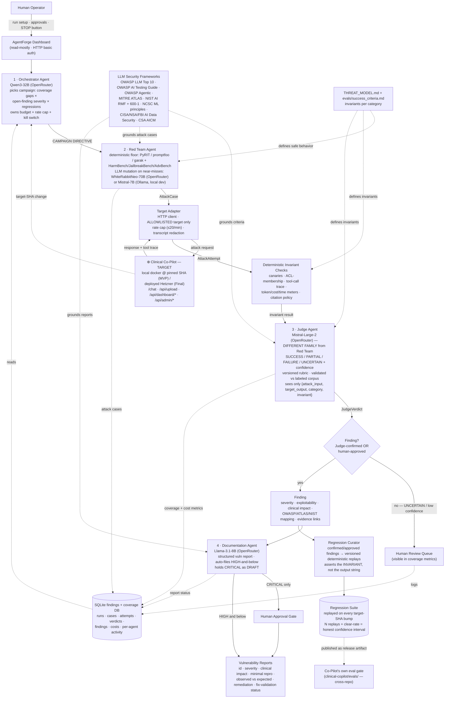

# ARCHITECTURE.md — AgentForge Multi-Agent Adversarial Evaluation Platform

_Target = the OpenEMR Clinical Co-Pilot (Weeks 1–2 build). Companion docs: [`THREAT_MODEL.md`](THREAT_MODEL.md) (the attack surface), [`evals/success_criteria.md`](evals/success_criteria.md) (the per-category invariants the Judge checks), [`presearch.md`](presearch.md) (constraints + decisions), [`src/agentforge/models.py`](src/agentforge/models.py) (the data contracts between agents)._

---

## Executive summary (~500 words)

AgentForge is a **multi-agent system that continuously red-teams the Clinical Co-Pilot, decides whether each attack succeeded, documents the confirmed ones, and converts them into permanent regression tests** — adapting as the target changes, with a human in the loop only where it matters. It is **not** a single agent or a linear pipeline: attack generation, evaluation, prioritization, documentation, and regression promotion are *different trust roles* with a built-in conflict of interest if combined, so they are separate agents.

**The four agents.** **(1) Orchestrator** — reads the observability state (coverage gaps, open high-severity findings, recent regressions, cost burn) and issues a campaign directive; owns the per-run budget, the rate cap, the cost-without-signal kill switch, and the regression trigger. **(2) Red Team** — turns a directive into `AttackCase`s; a *deterministic floor* (PyRIT / promptfoo / garak corpora + public datasets — HarmBench, JailbreakBench, AdvBench) runs every cycle, and a less-aligned open-weight LLM (WhiteRabbitNeo-70B via OpenRouter, or Mistral-7B via local Ollama for free dev iteration) is invoked *only to mutate near-misses*. **(3) Judge** — independent of the attack engine, on a different model family (Mistral-Large-2); verdicts `SUCCESS / PARTIAL / FAILURE / UNCERTAIN` with a confidence score; verdicts on **machine-checkable invariants** (defined in `success_criteria.md`) wherever possible, and on a labeled-corpus-validated rubric for the residual semantic cases; returns `UNCERTAIN` rather than guessing. **(4) Documentation** — turns a confirmed `Finding` into a reproducible vulnerability report (OWASP / ATLAS / NIST refs, clinical impact, minimal repro, remediation); auto-files HIGH-and-below, holds CRITICAL as a draft for human approval.

**Non-agent components.** A **Target Adapter** (HTTP client, allowlisted target only, rate-capped, transcript-redacted); a **Deterministic Invariant Checker** (canaries, ACL-membership, tool-trace, token/cost/time meters, citation policy); a **Regression Curator + Suite** (confirmed/approved findings → versioned replays that assert the *invariant*, not the output string; published as a release artifact the Co-Pilot's own `evals/` gate pulls in cross-repo); an **observability layer** (SQLite findings/coverage DB + JSONL audit log + a static HTML dashboard, deployed read-mostly behind basic auth with a manual STOP button).

**Coordination.** One LangGraph graph; the Orchestrator is the router node; agents hand off by mutating shared state, whose shapes are the `models.py` Pydantic classes — and downstream agents see attack content only as quoted structured fields, never as free-form context (the prompt-injection defense for AgentForge's own pipeline). The SQLite store is durable state + the data substrate the Orchestrator reads.

**Model strategy.** No main-LLM proprietary APIs. OpenRouter is the provider-routing layer (fallback chains, spend caps, data-policy filters); the deliberately less-aligned open-weight Red Team model directly answers the PRD's observation that "some commercial LLMs are intentionally trained to avoid offensive security workflows." Local Ollama for dev keeps cost near zero under a $10–50 weekly cap; the cost analysis measures ~100 runs and *projects* 1K/10K/100K with a stated methodology.

**Tradeoffs.** Simpler-than-distributed by choice: LangGraph + SQLite, not a Redis message bus or Postgres (roadmap). C1 (prompt injection) gets the full live closed loop; all nine categories have a deterministic seed floor + ≥ 1 live run against the deployed target (the dashboard shows 9/9 exercised — B2 via the `B2.improper-output` active-payload checker; C3's deterministic checker is a provenance stub, so its seeds run but adjudicate UNCERTAIN until the target exposes session state). The Documentation agent is a templated formatter, not a heavy reasoner. Everything traces back to published frameworks (§"Framework Mapping Chart" in `THREAT_MODEL.md`); AgentForge invents no taxonomy.

---

## End-to-end flow, in one sentence

> A human starts an authorized, budgeted run; the **Orchestrator** chooses what to test based on coverage gaps, open findings, and recent target changes; the **Red Team** turns that into bounded attack cases (deterministic corpus first, LLM mutation on near-misses only); the **Target Adapter** fires them at the allowlisted, rate-capped Clinical Co-Pilot at a pinned SHA; **deterministic invariant checks** and the **Judge** evaluate the response; confirmed (or human-approved) issues become **vulnerability reports** and **regression tests**; and the whole run records coverage, cost, per-agent activity, and evidence into the observability layer for review.

---

## Agent-interaction diagram



<details>
<summary>ASCII fallback (for renderers without Mermaid)</summary>

```
                Human Operator
                  |  run setup / approvals / STOP
                  v
            AgentForge Dashboard (read-mostly, basic auth)
                  |
                  v
   SQLite findings+coverage DB ---reads---> [1] ORCHESTRATOR AGENT
   ^  ^  ^                                      |  campaign directive
   |  |  |                                      v
   |  |  +--attack cases-------------------- [2] RED TEAM AGENT
   |  |                                  (deterministic floor: PyRIT/promptfoo/garak + datasets;
   |  |                                   LLM mutation on near-misses: WhiteRabbitNeo / Ollama-Mistral)
   |  |                                          |  AttackCase
   |  |                                          v
   |  |                                     TARGET ADAPTER (allowlisted, rate-capped, redacted)
   |  |                                          |  attack request          ^ response+trace
   |  |                                          v                          |
   |  |                                  (+) CLINICAL CO-PILOT TARGET  ------+
   |  |                                          |  AttackAttempt
   |  |                                          v
   |  |                                  DETERMINISTIC INVARIANT CHECKS (canaries/ACL/trace/meters/citations)
   |  |                                          |  invariant result
   |  |                                          v
   |  +--coverage+cost metrics------------- [3] JUDGE AGENT (Mistral-Large-2, different family;
   |                                             SUCCESS/PARTIAL/FAILURE/UNCERTAIN + confidence;
   |                                             sees only {attack_input,target_output,category,invariant})
   |                                              |  JudgeVerdict
   |                                              v
   |                                   < Finding? Judge-confirmed OR human-approved >
   |                                      |  no->Human Review Queue (in coverage metrics)
   |                                      |  yes
   |                                      v
   +--report status / regression status-- FINDING (severity/exploitability/clinical impact/framework map)
                                              |                              |
                                              v                              v
                                      [4] DOCUMENTATION AGENT          REGRESSION CURATOR
                                      (Llama-3.1-8B; auto-files        (asserts the INVARIANT,
                                       HIGH-and-below; CRITICAL         not the output string)
                                       -> DRAFT -> Human Approval Gate)        |
                                              |                                v
                                              v                          REGRESSION SUITE
                                      VULNERABILITY REPORTS              (replayed on every target-SHA bump;
                                      (OWASP/ATLAS/NIST refs;             N replays + clear-rate)
                                       repro; remediation;                    |
                                       fix-validation status)                 v  published as release artifact
                                                                        Co-Pilot's own eval gate
                                                                        (clinical-copilot/evals/, cross-repo)

   Grounded throughout by: OWASP LLM Top 10 · OWASP AI Testing Guide · OWASP Agentic ·
   MITRE ATLAS · NIST AI RMF+600-1 · NCSC ML principles · CISA/NSA/FBI AI Data Security · CSA AICM
   and by THREAT_MODEL.md + evals/success_criteria.md (the invariants).
```
</details>

---

## The four agents — role · inputs · outputs · model · trust level · must-not

### 1. Orchestrator Agent
- **Role.** The strategist. Reads the observability state and decides *what to test next* — never executes attacks itself.
- **Inputs.** The SQLite findings/coverage DB (per-category attempt counts, open-finding severities, recent regressions, spend-so-far), the target's current git SHA, the run budget.
- **Outputs.** A `CAMPAIGN DIRECTIVE` (which `ThreatCategory`, against which target, with what dollar/token budget, single- or multi-turn, deterministic-only or with LLM mutation), and `REGRESSION TRIGGER`s when the target SHA changes.
- **Model.** Qwen3-32B via OpenRouter (structural reasoning, JSON-mode; can downgrade to an 8B if cost demands — it's a small decision per cycle).
- **Trust level.** Medium. It controls *what* runs and *how much* is spent, so it owns the kill switches; it cannot itself touch the target or write findings.
- **Must not.** Exceed the run budget; keep a category running with no signal past `COST_NO_SIGNAL_CEILING_USD`; pick a target outside the allowlist; ignore a human STOP.
- **Prioritization heuristic.** `next_category = argmax over categories of  w1·coverage_gap + w2·open_finding_severity + w3·recent_regression − w4·cost_without_signal`. Deterministic floor runs every cycle regardless; LLM mutation only when a deterministic attack came within the "near-miss" band of tripping the invariant.

### 2. Red Team Agent
- **Role.** The attacker. Turns a directive into concrete `AttackCase`s and executes them (via the Target Adapter).
- **Inputs.** A `CAMPAIGN DIRECTIVE`; the seed attack corpus (PyRIT orchestrators incl. Crescendo & TAP; promptfoo's OWASP-LLM-Top-10 plugins; garak probes; HarmBench / JailbreakBench / AdvBench / prompt-injection datasets); near-miss `AttackAttempt`s from the previous cycle (for mutation); the per-category "expected safe behavior" + invariant from `THREAT_MODEL.md` / `success_criteria.md`.
- **Outputs.** `AttackCase`s (with `framework_refs`, `invariant_id`, `source`), and the resulting `AttackAttempt`s after execution.
- **Model.** *Attack generation/mutation:* WhiteRabbitNeo-70B via OpenRouter (a Llama-3 fine-tune purpose-built for authorized security testing), with Dolphin-3-Llama-70B as the "it refused / unavailable" fallback; **or** Mistral-7B via local Ollama for free dev iteration. *Mutation strategy / multi-turn planning:* Qwen3-32B via OpenRouter (structural — not the refusal-prone surface). Frontier RLHF models are deliberately not used here; see the FAQ. *(Exact OpenRouter model slugs to be verified against `openrouter.ai/models` during the build.)*
- **Trust level.** Low — it is *expected* to produce adversarial content; that's why it runs against an allowlisted, rate-capped, synthetic-data-only target, and why its outputs are schema-validated and passed downstream only as quoted data.
- **Must not.** Target any host but the allowlisted Co-Pilot; exceed the rate cap; use real PHI; produce attack content for any purpose other than evaluating this target.

### 3. Judge Agent
- **Role.** The independent evaluator. Decides whether each `AttackAttempt` succeeded.
- **Inputs.** **Only** `{attack_input, target_output, category, invariant}` — never the Red Team's reasoning or intent (independence by construction). For deterministic categories, also the structured invariant result from the Deterministic Invariant Checker.
- **Outputs.** A `JudgeVerdict`: `observed_behavior ∈ {SUCCESS, PARTIAL, FAILURE, UNCERTAIN}`; `invariant_passed` (bool, for deterministic checks); `confidence ∈ [0,1]` (for semantic-judgment checks); a rationale citing the invariant + the evidence; `judge_model` + `judge_prompt_version` (so the verdict can be re-validated when the prompt changes).
- **Model.** Mistral-Large-2 via OpenRouter — a **different family** from the Red Team's Llama-WhiteRabbitNeo / Qwen models, so blind spots don't correlate (the "model diversity = different reviewers" principle). Foundation-Sec-8B is an alternative if cost demands. **Deterministic invariant checks need no LLM at all** — most structural categories (cross-patient exfil, tool-misuse, DoS, ACL bypass) are adjudicated by a Python assertion; the LLM-Judge only handles the semantic residual (persona dropped? safeguard bypassed?).
- **Trust level.** High — its verdicts gate findings, reports, and regressions. Therefore: it must be *validated itself*.
- **Must not.** Drift; treat `UNCERTAIN` as `PASS` or `FAIL` (uncertain is visible in coverage and routes to human review); read the Red Team's reasoning; auto-promote a verdict it scored below `JUDGE_LEAD_FLOOR_CONFIDENCE` to a finding.
- **Judge validation (the load-bearing artifact).** A labeled ground-truth corpus (`evals/judge_corpus/`, ~30–50 hand-adjudicated attack transcripts, ~half successful / ~half not) with a measured agreement / false-positive / false-negative rate. Re-run on **every** Judge-prompt change; CI fails the change if agreement drops below threshold. The measured rate is reported in the README and the dashboard. A Judge whose accuracy is unmeasured makes the whole platform unfalsifiable — this is the difference between "defensible to a CISO" and "a cool demo."

### 4. Documentation Agent
- **Role.** The scribe. Turns a confirmed `Finding` into a vulnerability report a senior security engineer who wasn't present could reproduce, validate, and fix.
- **Inputs.** A `Finding` record (severity, exploitability, clinical impact, framework mapping, evidence links) — read as structured fields, with the attack string in a `raw_attack:` JSON field, never as free-form context.
- **Outputs.** A markdown vulnerability report: unique ID + severity; description + clinical impact; minimal reproducible attack sequence; observed vs expected behavior; recommended remediation (grounded in NCSC ML principles / CSA AICM controls); current status + fix-validation results. Auto-files HIGH-and-below as final; holds CRITICAL as a draft pending human approval.
- **Model.** Llama-3.1-8B via OpenRouter — cheap, templated; no reasoning surface.
- **Trust level.** Medium — a confidently-wrong report wastes engineering time, so CRITICAL reports pass a human gate; nothing is auto-published.
- **Must not.** Embed PHI in a report (the inputs are already redacted); file a CRITICAL report without human approval; trigger remediation or open tickets.

---

## Non-agent components

- **Target Adapter** (`agentforge.target`). The only thing that talks to the target. Enforces the allowlist (one target: the Co-Pilot at `COPILOT_BASE_URL` / `COPILOT_TARGET_SHA`), the rate cap (`RATE_LIMIT_RPM`), the per-run timeouts (`RUN_TIMEOUT_SINGLE_TURN` / `_MULTI_TURN`), a `/healthz` check before each batch (halt + surface "target unavailable" if down), and transcript redaction (a `safe_log.py`-pattern pass) before anything reaches storage. Captures the response + the tool-call trace + token/cost/latency/hop counts into an `AttackAttempt`.
- **Deterministic Invariant Checker** (`agentforge.invariants`). One Python checker per invariant in `success_criteria.md` — canary/sentinel detection, ACL-set membership against the session's panel, tool-call-trace assertions vs the worker bindings/allowlist, token/cost/wall-time/loop-iteration/amplification meters vs `evals/thresholds.yaml`, the citation policy. Output: a `bool` (and, where relevant, which sub-clause failed). This is the "no LLM" path; ~90% of verdicts come from here.
- **Regression Curator + Suite** (`agentforge.regression`). When a `Finding` is Judge-confirmed *or* human-approved, the Curator converts it to a versioned deterministic replay — a fixed conversation prefix + the invariant it asserts (never the model's exact output string). The Suite runs the replays on every target-SHA bump (`pytest` + `httpx`), `N` times each, reporting `(N, clear_rate, target_sha, date)` — an honest confidence interval, not a binary PASS/FAIL, because the target is nondeterministic. Detects reappearance (a resolved finding goes back to FAIL) and cross-category regressions (fixing X breaks Y). The Suite is published as a release artifact the Co-Pilot's own `clinical-copilot/evals/` gate pulls in (cross-repo, since AgentForge lives in its own repo).
- **Observability layer** (`agentforge.observability` + `agentforge.dashboard`). The SQLite findings/coverage DB (one table per `models.py` class) is durable state *and* the data substrate the Orchestrator reads. A JSONL audit log records every Orchestrator decision / Red Team attack / Judge verdict / Documentation generation / target HTTP request. A static HTML dashboard (Jinja2-rendered by the GitHub Action, committed as an artifact, and served at the deployed URL behind HTTP basic auth) answers the six PRD-required questions: *which categories have been tested and how many cases each · current pass/fail/partial/uncertain rate by category and target SHA · is the target getting more or less resilient over time · which findings are open / in-progress / resolved · how much did this run cost and at what rate is cost scaling · what is each agent doing and in what order.* The dashboard has a manual **STOP button** (the human kill switch).
- **LLM router** (`agentforge.llm`). A thin wrapper over the OpenRouter OpenAI-compatible endpoint (fallback chains, per-key spend caps, data-policy filters), switchable to a local Ollama endpoint via `MODEL_BACKEND` for free dev iteration. One call interface for all four agents.

---

## Inter-agent communication & state

- **Mechanism.** One LangGraph graph. The Orchestrator is the router node; Red Team / Judge / Documentation are nodes; hand-off is state mutation, not a message queue. The shared state's shapes are the `models.py` Pydantic classes; the SQLite store is the durable backing.
- **Message shapes.** `CAMPAIGN DIRECTIVE` (Orchestrator → Red Team), `AttackCase` (Red Team → Target Adapter), `AttackAttempt` (Target Adapter → Invariant Checker / Judge), `JudgeVerdict` (Judge → Finding decision), `Finding` (→ Documentation + Regression Curator), `RunRecord` (the run-level accounting). Every one is a validated Pydantic model — a malformed object can't reach the next agent.
- **Prompt-injection defense for AgentForge itself.** Attack strings flow back into the Judge and Documentation agents. They are presented *only as quoted data on structured fields* (`attack_input`, `raw_attack:`), never as instructions; no agent has a "react to whatever you see" system prompt; agent outputs are schema-validated between hops. (OWASP Multi-Agentic threat modeling applied to ourselves — see `THREAT_MODEL.md` §8.)
- **Failure handling.** Provider 502 → OpenRouter falls back to the next model in the chain; if all fail, mark `provider_error`, skip the run. PyRIT/promptfoo exception → mark `tool_error`, continue. Target 5xx → `/healthz` check, halt the batch, surface `target_unavailable`. Per-run timeout → hard kill, mark `timeout`, the Orchestrator records the timeout rate as a signal. Cost ceiling approached → Orchestrator switches the run to deterministic-only (no LLM mutation). Human STOP → the run halts at the next safe point and records `human_stop`.

---

## Orchestration strategy at scale

| Volume | Strategy |
|---|---|
| **~100 runs (build / demo)** | Don't optimize. LLM may pick every next attack; full model set; ~$1–4 total. |
| **~1K runs** | Cache successful attack templates + their mutation lineage; deduplicate near-identical prompts (embedding-similarity gate). ~$10–40. |
| **~10K runs** | Flip the default: a cheap multi-armed bandit (UCB/Thompson) over the cached template library picks the next variant; the LLM is invoked **only on novel signal** (a new refusal pattern, a near-miss, a target-behavior change). Drop the mutation model to the cheapest competent option; batch the Judge calls (provider batch tiers ≈ −50%). Target < $0.005/run. |
| **~100K runs** | Bandit + template library is the workhorse; LLM mutation is a thin <5% "exploration" slice triggered by anomaly detection. Doc agent stays tiny. The architecture change at this scale is *worker parallelism* — which is where a real message bus (Redis Streams) and a real DB (Postgres) replace the in-process LangGraph state + SQLite. Target ~$0.002–0.004/run. |

**Cost analysis deliverable:** measure ~100 real runs, project 1K/10K/100K from the measured per-run cost with the methodology above stated explicitly — *not* `cost_per_token × n`. Running 10K real attacks (~$200–400) would blow the $10–50 cap and is the wrong move; modeling the scaling regimes is more defensible than burning the money. The "no main LLMs" choice keeps per-run cost an order of magnitude below a frontier-model platform.

---

## Where AI is used vs deterministic tooling — and why

| Function | AI or deterministic? | Why |
|---|---|---|
| Attack *corpus* (the floor) | **Deterministic** (PyRIT / promptfoo / garak + public datasets) | Reproducible, auditable, free, not dependent on a provider's refusal policy. More defensible than "we asked an LLM to be evil." |
| Attack *mutation* (near-misses → variants) | **AI** (WhiteRabbitNeo / Mistral-7B-local) | Generating *novel* variants of a partially-successful attack is the one place a static list runs out — that's the PRD's "probe, mutate, escalate" requirement. |
| Verdict on structural invariants (cross-patient ID present? tool outside binding? token cap exceeded? ACL bypassed?) | **Deterministic** (Python assertions) | A string match / set membership / trace check is exact, fast, free, and re-runnable by hand — exactly what a regression test needs. |
| Verdict on semantic judgments (persona dropped? safeguard bypassed?) | **AI** (Mistral-Large-2, validated vs a labeled corpus) | No deterministic check captures "did the assistant comply with a roleplay request to drop its safety persona?" — but the corpus measures how often the LLM-Judge gets it right. |
| Vulnerability report generation | **AI** (Llama-3.1-8B, templated) | Filling a structured report template from a `Finding` record — low reasoning, high throughput. |
| Campaign prioritization | **AI** (Qwen3-32B) | Reading the coverage/finding/cost state and picking the next category is a judgment call — but it's a *small* one each cycle, with hard guardrails (budget, kill switch, allowlist) around it. |
| Regression replay execution | **Deterministic** (`pytest` + `httpx`) | Replays a fixed prefix and asserts the invariant. The only nondeterminism is the *target*; we report `N` replays + clear-rate accordingly. |

---

## Trust boundaries & human approval gates

- **Where the human stays in the loop:** (1) starting a run (run setup); (2) the **STOP button** on the dashboard (halt mid-run); (3) the **CRITICAL-finding approval gate** (no CRITICAL vuln report is filed without sign-off); (4) the **human-review queue** for `UNCERTAIN` / low-confidence verdicts; (5) approving the addition of a confirmed finding to the regression suite that gates the Co-Pilot's CI (a regression test that wrongly fails the Co-Pilot's build is worse than no test).
- **Where it proceeds autonomously:** running the deterministic attack floor; LLM mutation within a budget; deterministic invariant verdicts; auto-filing HIGH-and-below reports; regression replays on a target-SHA bump.
- **How confidence is communicated:** every semantic-judgment verdict carries an explicit `confidence` and the Judge's `judge_prompt_version`; the dashboard shows the Judge's measured agreement rate; vulnerability reports state "fix-validation status" honestly (open / fixed-and-regression-holds / fix-planned). When the platform is wrong, the path is: the human reviewer overrides the verdict → the corrected case goes into the Judge corpus → the Judge prompt is re-tuned and re-validated.

---

## State & coordination framework — and what we're not doing

- **Chosen:** LangGraph (one graph, supervisor pattern), SQLite (durable findings/coverage state = the observability substrate), the OpenRouter SDK in-process as the LLM router, Ollama for local dev. Stack-consistent with the W1/W2 Co-Pilot build; lowest ops for a 4.5-day solo build.
- **Not doing (roadmap):** a Redis Streams message bus (other strong submissions use one — it's the right move at multi-worker scale, but it's real ops the MVP doesn't need); Postgres (SQLite suffices single-node); a hosted observability service like Langfuse/LangSmith/Braintrust (the SQLite + JSONL + dashboard layer answers the required questions; add Langfuse later if debug-time hurts); full multi-turn mutation for *every* category at MVP (C1 gets it; the rest come Final); a "real" reasoning Documentation agent (templated formatter is enough); self-hosting a large model (deployment box is ~3.7 GB; OpenRouter + local-dev-Ollama instead).
- **Cut list if behind on Tuesday:** Orchestrator "intelligence" → a plain priority queue; multi-turn → single-turn for the demo; the deployed dashboard → CI-only HTML artifact (no URL until Wed). **Never cut:** the Judge validation corpus, the target-isolation/allowlist posture, transcript redaction.

---

## Reviewer Q&A (FAQ)

**Why does this need multiple agents?** Attack generation, evaluation, prioritization, documentation, and regression promotion are different *trust roles*. A Red Team agent is incentivized to explore and mutate; a Judge must be independent and conservative; an Orchestrator manages cost and coverage; a Documentation agent must be reproducible and not over-claim. Combining attack-generation and evaluation in one context is a conflict of interest by design — and a single-agent or linear-pipeline architecture doesn't satisfy the assignment.

**Why not just use a static prompt list?** Static payload lists age quickly; defenses built around a handful of known examples rarely hold as attackers adapt. The platform must *mutate* partially-successful cases, *prioritize* under-tested categories, and *convert* confirmed issues into regression tests — that requires an orchestrated loop. (The static lists are still the *seed* — see the deterministic floor.)

**How does this avoid reinventing LLM security research?** Every threat category maps back to OWASP LLM Top 10 2025, the OWASP AI Testing Guide, OWASP Agentic-AI threat modeling, MITRE ATLAS, NIST AI RMF / AI 600-1, NCSC's ML security principles, the CISA/NSA/FBI AI Data Security guidance, and the CSA AI Controls Matrix — see the Framework Mapping Chart in `THREAT_MODEL.md`. The attack corpus is PyRIT / garak / promptfoo / HarmBench / JailbreakBench / AdvBench. AgentForge's contribution is the *orchestration, the invariant-based Judge, the regression-into-the-eval-gate loop, and the Co-Pilot-specific threat model* — not a new taxonomy and not hand-written payloads.

**What is the first target surface?** The Clinical Co-Pilot's chat API (`/chat`, `/chat/stream`) — direct prompt injection, cross-patient exfiltration, the zero-citation bypass, tool misuse — and the document-upload → vision-model channel for indirect injection. The dashboard / admin / clinical-notes-write surfaces come after the chat harness is stable.

**How do you prevent runaway cost?** Every run has an explicit dollar/token budget. The Orchestrator halts when spend approaches the cap, when a category produces no signal past `COST_NO_SIGNAL_CEILING_USD`, when the target becomes unreliable, or when a Critical finding needs review. Deterministic checks run *before* expensive LLM judging. OpenRouter enforces a per-key daily spend cap. At scale, a bandit over cached templates replaces "LLM picks every attack."

**Why OpenRouter? Why no main LLMs?** The PRD notes that "some commercial LLMs are intentionally trained to avoid offensive security workflows" — and frontier RLHF models do refuse, soften, or hallucinate adversarial-prompt generation even under explicit authorized-pentest framing, which makes coverage numbers fiction. So the Red Team's attack generator is a less-aligned open-weight model purpose-built for authorized security testing (WhiteRabbitNeo), accessed via OpenRouter (provider routing, fallbacks, spend caps, data-policy filters) — or run locally via Ollama for free dev iteration. The Judge is a *different* open-weight family for independence. This is a deliberate, defensible choice, not a constraint we backed into.

**What happens when the Judge is unsure?** It returns `UNCERTAIN`. Uncertain verdicts are visible in coverage metrics (not silently treated as pass or fail), routed to a human-review queue, and can be re-run with stricter criteria or used to guide more targeted tests. Below `JUDGE_LEAD_FLOOR_CONFIDENCE`, a verdict is stored as a *lead*, not a confirmed finding.

**How do you know the Judge itself is right?** It's validated against a labeled ground-truth corpus (~30–50 hand-adjudicated transcripts) with a measured agreement / FP / FN rate, re-run on every Judge-prompt change; the rate is published on the dashboard and CI fails a Judge change that drops it below threshold.

**How does a vulnerability become a regression test?** A `Finding` must be Judge-confirmed *or* human-approved; then the Regression Curator converts it into a versioned case — a fixed conversation prefix + the invariant it asserts (not the model's exact output string). It re-runs on every target-SHA bump, `N` times, reporting the clear rate. Adding it to the suite that gates the Co-Pilot's *own* CI requires human approval.

**What prevents the platform from being misused?** The Target Adapter enforces an allowlist (one target only); runs are budgeted; reports are not auto-published; CRITICAL reports need human approval; agents cannot trigger remediation, open tickets, or test arbitrary hosts; the data is synthetic; transcripts are redacted; API keys live in GitHub Secrets / a gitignored `.env`. The system is built for authorized defensive evaluation of *this* target only.

**What will reviewers see in the UI?** Run history; category coverage and per-category attempt counts; pass / fail / partial / uncertain rates by category and target SHA; the resilience trend line; findings by severity (open / in-progress / resolved); report drafts; regression status; the Judge's measured agreement rate; and cost by run / category / agent / model / provider. Plus a STOP button.

---

## Repo layout

```
agentforge/                         (this repo — GitHub: Hvoegeli/agentforge · GitLab: williamvoegeli/agentforge · MIT)
├── README.md                       (overview, setup, run instructions, deployed link)
├── ARCHITECTURE.md                 (this file — multi-agent design + agent-interaction diagram)
├── THREAT_MODEL.md                 (attack surface + Framework Mapping Chart + Resolved items / Fix status + glossary)
├── USERS.md                        (who uses AgentForge, workflows, use cases, why automation)
├── COST_LATENCY_REPORT.md          (agent-side cost model + 100/1K/10K/100K projection + refresh recipe)
├── presearch.md                    (constraints, decisions, open items)
├── dashboard.html                  (rendered observability dashboard — static, self-contained)
├── deploy-dashboard.sh             (regenerate the dashboard from a live run + scp it to the serving box)
├── evals/
│   ├── success_criteria.md         (the invariant table — the Judge's spec)
│   ├── judge_corpus/               (labeled ground-truth transcripts — the Judge validation set)
│   ├── thresholds.yaml             (token / cost / wall-time / hop / amplification thresholds for the DoS invariants)
│   └── results/                    (committed run artifacts)
├── src/agentforge/
│   ├── models.py                   (the Pydantic contracts between agents)
│   ├── cli.py                      (entrypoint: run / status / replay / validate-judge / dashboard / seed-findings / regression-suite)
│   ├── config.py                   (settings + the target-host allowlist)
│   ├── llm.py                      (OpenRouter / Ollama model router)
│   ├── known_findings.py           (the 6 seeded Co-Pilot findings — 4 day-one + 2 from the 2026-05-12 pen-test)
│   ├── target/                     (Target Adapter — HTTP client, host allowlist, rate cap, redaction)
│   ├── attacks/                    (deterministic floor — PyRIT/promptfoo/garak wrappers + curated corpus + the Red Team agent + LLM mutation + poisoned-doc rendering)
│   ├── invariants/                 (the deterministic checkers, one per success_criteria invariant + thresholds loader)
│   ├── judge/                      (the Judge agent + the LLM-Judge + the corpus-validation harness)
│   ├── documentation/              (the Documentation agent + report templates)
│   ├── orchestrator/               (the Orchestrator agent + the LangGraph StateGraph + the priority heuristic)
│   ├── regression/                 (the Regression Curator + Suite — replay_case / replay_finding)
│   ├── storage/                    (SQLite findings DB + JSONL trace writer)
│   ├── observability/              (metrics computation for the dashboard)
│   └── dashboard/                  (Jinja2 render → static HTML)
├── tests/                          (pytest — 201 tests)
├── .github/workflows/              (ci.yml; a scheduled attack-loop workflow is a roadmap item)
├── pyproject.toml · uv.lock · .env.example · LICENSE · .python-version
```

The *target* (the Clinical Co-Pilot) lives in a separate repo ([Hvoegeli/openemr](https://github.com/Hvoegeli/openemr)). AgentForge reaches it over HTTP — no shared process, no shared database, no shared CI. AgentForge's confirmed-exploit regression suite is published as a release artifact that the openemr repo's CI can pull in to gate the Co-Pilot's build.

---

## Status (mirrored from `THREAT_MODEL.md` / `evals/success_criteria.md`)

The MVP-baseline verification items are **resolved** — see `THREAT_MODEL.md` § *Resolved items* and § *Fix status*:

1. Panel ACL on the Co-Pilot's patient-scoped HTTP endpoints — verified: dashboard / document-source are panel-gated; `/api/binary/{id}` was **not** at baseline `74aa5be4` → **day-one C2 IDOR finding** (fixed in `1055abd71`).
2. Client-supplied conversation history — verified: `/chat` does not accept it; *but* the `SESSIONS` store was keyed by `session_id` alone (no owner check), which — with `/api/traces` being login-gated, not admin-gated — is a **session-adoption cross-panel PHI chain** (both surfaced by a 2026-05-12 manual pass; both fixed in `1055abd71`; both seeded as C2 findings + regression cases).
3. Worker→tools loop bound — verified: bounded by `MAX_SUPERVISOR_ROUTES = 4` (so C5's `N = 4`; the genuinely unbounded C5 vectors are the document fan-out and the no-per-request-token-cap).
4. Co-Pilot SHA — pinned at `74aa5be4` (the MVP regression baseline) at the top of `THREAT_MODEL.md`; the live deployment now runs `1055abd71`.
5. `evals/thresholds.yaml` — filled from `clinical-copilot/COST_LATENCY_REPORT.md` p95 figures + a live local C1 run.

Still open (Final-week): production-grade Judge corpus; live re-execution for the HTTP-setup findings (`raw_http_get` / `session_adoption`) + an admin observability account so the adapter can enrich C4/C5 attempts with trace data against the patched target (which now 403s `/api/traces` for non-admins — the F6 fix); confirming the exact OpenRouter model slugs; re-pinning the baseline.
